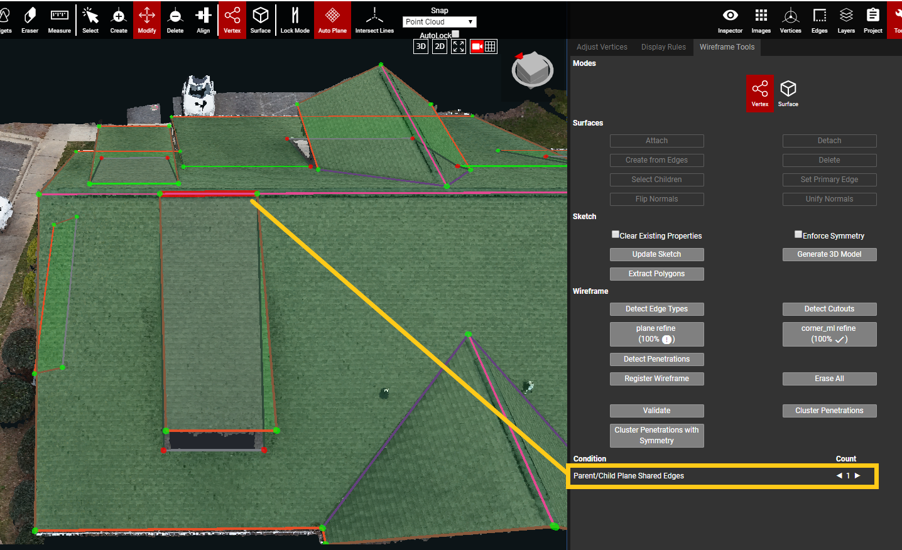
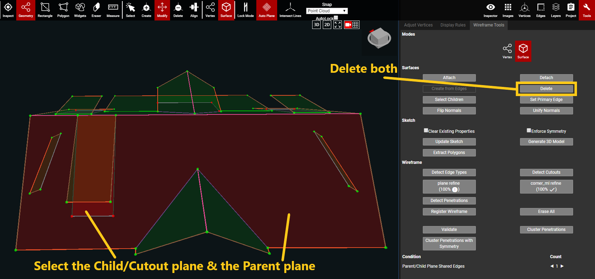
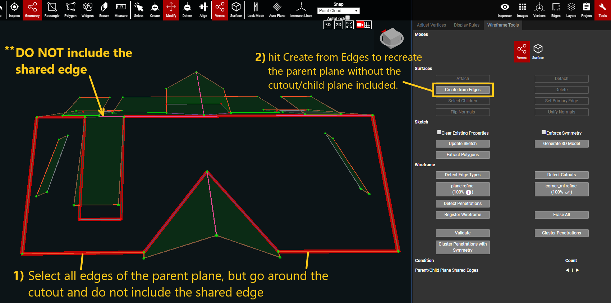
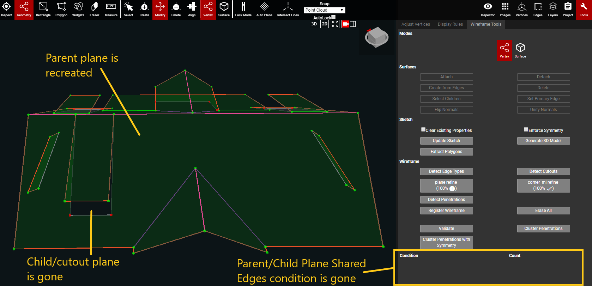

# Validate

The Validate button will evaluate the current view of the wireframe and list all of the conditions \(issues\) found within it. When the project is saved, Validate is automatically triggered. However, the project can be validated without saving too. 

Using the Validate button, in either the Wireframe Tools panel or the Project Validations panel, is a quick way to check for errors without saving the project. 

Clicking on each condition's name will select all of the objects with that error in the 3D window. Every item with that condition will be selected on the point cloud. and it will focus the camera view on all of the selected objects at once. 

Count displays the number of objects for each listed condition. To the right of the condition name, the count number is shown with white arrows on each side. When an arrow is clicked, the 3D view will rotate and highlight one object at a time.

#### List of Conditions:

| **Condition** | Definition | Solution |
| :--- | :--- | :--- |
| **Isolated Vertex** | Vertex is not attached to any edges | Delete the isolated vertex. |
| **Isolated Edge** | Edge does not belong to any plane | If it's an extra edge, then delete it. If it's an edge that's connected to a missing plane, then reform the plane. |
| **Coincident Vertices** | Two vertices are too close to one another | This can be ignored if the vertices are in the correct location, but just close to each other. If the vertices are on top of each other, the extra one should be deleted. |
| **Colinear Adjacent Edges** | Extra vertex in the middle of an edge | Delete the extra vertex. If this is due to the wireframe going around a curved section, then this condition can be ignored. |
| **Missing EdgeTypeProperty** | Edge does not have an Edge Type assigned | Assign an edge type to the edge. |
| **Inconsistent Plane Normals** | The Plane Normals do not point in the same direction | This can be ignored. |
| **Parent/Child Plane Shared Edges** | The edge of a cutout is shared with its parent plane's edge | Delete the parent plane and the cutout plane. Use Create from Edges to recreate the parent plane around the cutout -- do not include the shared edge. |

\*Fix the warning below this. The "cutout standard from kespry" links to a page in the weekly updates section. Add a section here for: Instructions on how to handle Parent/Child Plane Shared Edges and example images

#### How to fix Parent/Child Plane Shared Edges Condition:

* In the example below, the cutout/child plane shares part of the parent plane's ridge edge. The shared part of the ridge is highlighted in red.

* Select the cutout/child plane and the parent plane. Delete both of them.

* Once the cutout/child plane and parent plane are deleted:
  * select all of the edges of the parent plane and select the edges to go around the cutout plane
    * **DO NOT** select the shared edge!
  * With all edges of the new parent plane selected, click Create from Edges to recreate the parent plane without the cutout

* After Create from Edges is clicked, the new parent plane will be formed. Hit the Validate button again, and the Parent/Chile Plane Shared Edges condition will be gone.

