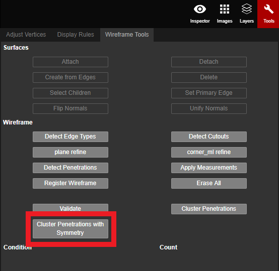

# Cluster Penetrations with Symmetry

Cluster Penetrations with Symmetry classifies and assigns labels to all of the penetrations, like Cluster Penetrations does, but it also tweaks the measurements of the penetrations. This results in penetrations of the same type measuring exactly the same and getting matching labels too.


Cluster Penetrations with Symmetry should be performed after Detect Penetrations and after Cluster Penetrations have been completed.


