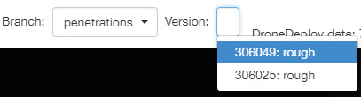
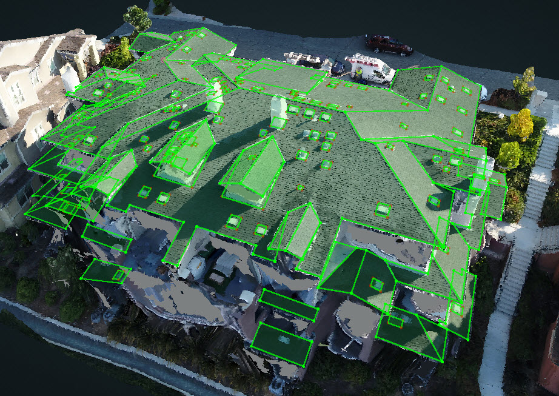

# Detect Penetrations

 Detect Penetrations is used after the structure's roof is completely wireframed and adjusted.

The Detect Penetrations button, in the Wireframe Tools subgroup, is going to detect all of the penetrations automatically.

Under a new Branch called Penetrations, there will be a new version with Penetrations

There might be some extra, or missing, penetrations and some of the penetrations may not be accurate, but the process is constantly being updated and improved.

