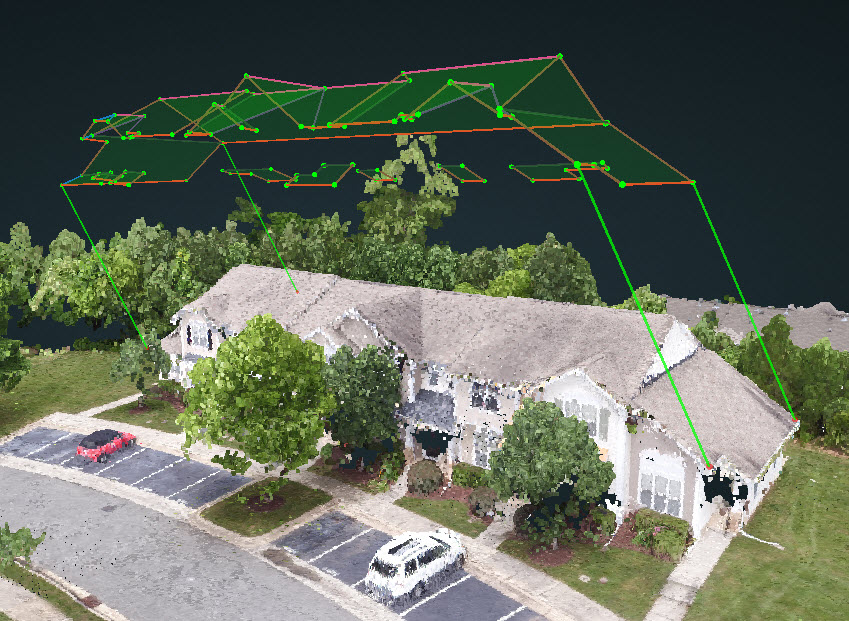

# Register Wireframe

When an imported wireframe does not automatically snap to the point cloud \(due to differing coordinates\), the Register Wireframe feature can be used to automatically move, rotate, and snap the wireframe onto the point cloud.

1. Create a new edge from one of the vertices on the imported wireframe, and connect it to the same location it should be on in the point cloud. 
2. Then use [Adjust Vertices](../../adjust-vertices/), with 2image or 3image triangulation, to adjust the endpoint on the cloud and ensure it is in the accurate location.
3. Repeat Step 2 for each different vertex, until there are 4 new edges.
   * There can be more than 4 vertices/edges created.
   * Try to place these new vertices on multiple levels of the point cloud.
     * Connecting them on differing plane levels, will yield better results in the registration.

1. Hold `Ctrl` and left-click each edge to select all newly created edges. Then click the Register Wireframe button in the Wireframe Tools tab of the Tools section.


The vertices of the wireframe being registered will already be verified from the original project it was exported from. The vertices will still need to be checked after clicking Register Wireframe to re-verify that they are in the correct location. Adjust Vertices may need to be used to tweak some of the vertex locations to make them more accurate. This is why it is important to ensure that the endpoint vertex location is accurate before clicking Register Wireframe.


