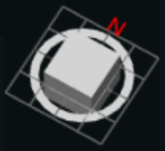
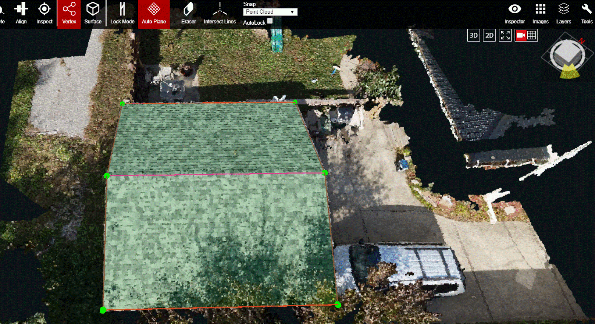
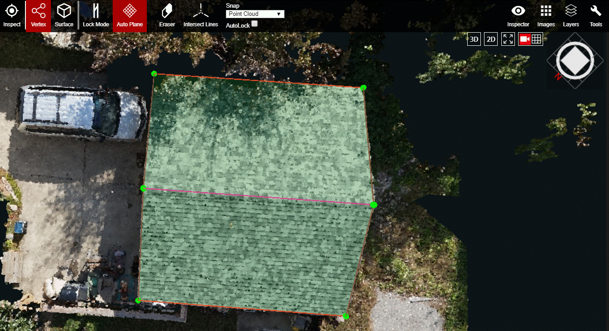
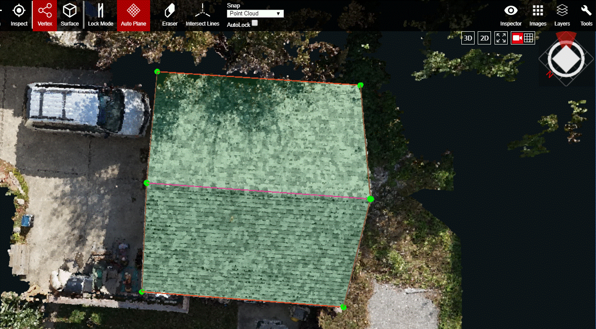

# View Cube

The View Cube is the compass of the 3D viewport. It allows the user to control the viewport's direction in relation to the true north of the point cloud's location.

Click on any side of the cube, or hover over the grid and click one of the yellow highlighted sections, and the point cloud will be oriented to that directional view. The side of the View Cube or the section of the grid that was selected will stay highlighted yellow. Double clicking on a side of the cube, or a yellow section of the grid, will lock the point cloud and viewport to that directional view. While the View Cube is locked, the selected side of the cube or section of the grid will be highlighted red. The point cloud can be zoomed in/out, panned in any direction, and rotated in the X, Y directions using the 'Q' and 'E' hotkeys only. It can not be rotated in the Z direction. To unlock the View Cube, click anywhere in the grid area.

  
In the image above, the mouse is hovering over the Southeast corner of the view cube grid. The grid has not been clicked yet and the view cube is not locked to, or oriented in, the Southeast direction.

Once the yellow highlighted SE corner of the grid is clicked, the view of the point cloud and view cube will be reoriented toward the SE direction. The View Cube and grid will be their default grey color, like what is shown in the image above.

If the SE corner of the View Cube grid is double clicked instead of single clicked, then the SE corner of the grid will turn red in addition to the point cloud and View Cube being oriented in the SE direction. The red signifies that the point cloud is now locked to the SE. This is the mode that allows users to pan across the point cloud but not rotate it in 3D.


When the view cube is locked, the point cloud can't be rotated in 3D but it can still be rotated in 2D using the Q and E hotkeys.


