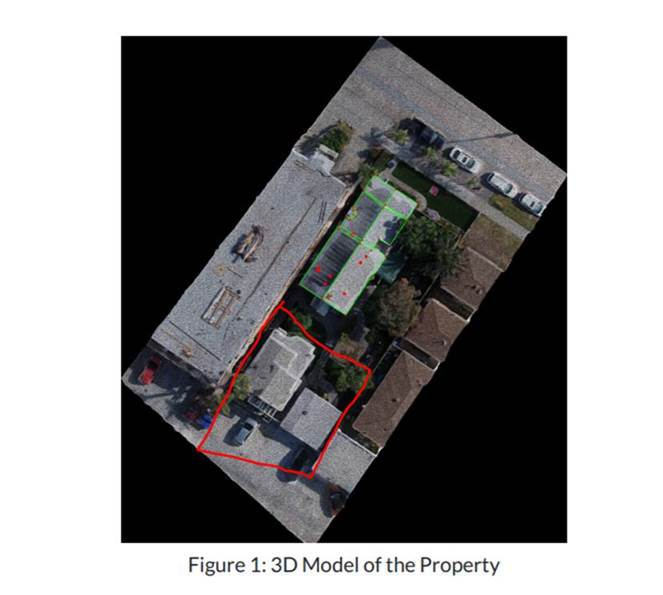

# August 10th 2018

## ⛔ Do not miss the minor structure for Tesla project

`From DroneDeploy    
For the Tesla jobs can you guys please do all structures on the property. Look back they see to also want additional buildings that are modeled like the carport.`


Please do not miss the secondary structure for DD label obstruction projects. Following are some examples, in which we have missed the minor structure/garage during the last three months.


## 🏡 Structure Types

## 💉 Project Issues

## 👮 Respect the reviewer feedback

Thanks for all the reviewers during these days first!  
**Amir**🧔 / **Adnan**👨‍ / **Rose**👩 / **Katherine**👧 / **Tianze**🧑 / **Habib**👨‍💻 / **Dan** 👨‍💼

Quote from Review Standard 

`The purpose of reviewing a project is not only to complete final the project, also to let the reviewee know the issues then the reviewee may not make the same kind of mistake anymore. So reviewer needs to post the issues in the wireframe channel and let the reviewee know, then reviewee should go back to fix the issue and let reviewer review again.`

Ideally, after review, **every project owner should go back to fix the issue and let reviewer review again.** However, since some of the mistakes are not critical or sometimes the owner has signed off after the review, so reviewer fix the issue directly by himself but leave a message under the thread of the IN\_REVIEW message in Slack. **But, what is disappointing is the project owner never reply the review's message and the review is even not sure whether the owner see the feedback or not.**

As we all know, reviewer spend a lot of time reviewing the project and sometimes the review time is even longer than the owner qa time, not to say the time reviewer spend on capturing the screen and describing the issue to the owner. The only reason the reviewer is giving feedback to the owner is to improve the project owner performance and hopefully every project owner can become the reviewer someday.

It is not required for every owner to go back to the project to fix every minor mistakes, but every project owner, please make sure you read the review feedback and do not leave the review alone.


**A easy thumbs up Emoji reaction or simple Thanks will make our reviewers feel warm.** 


## 💯The Complete Final Grading Phase of Fawad

 

