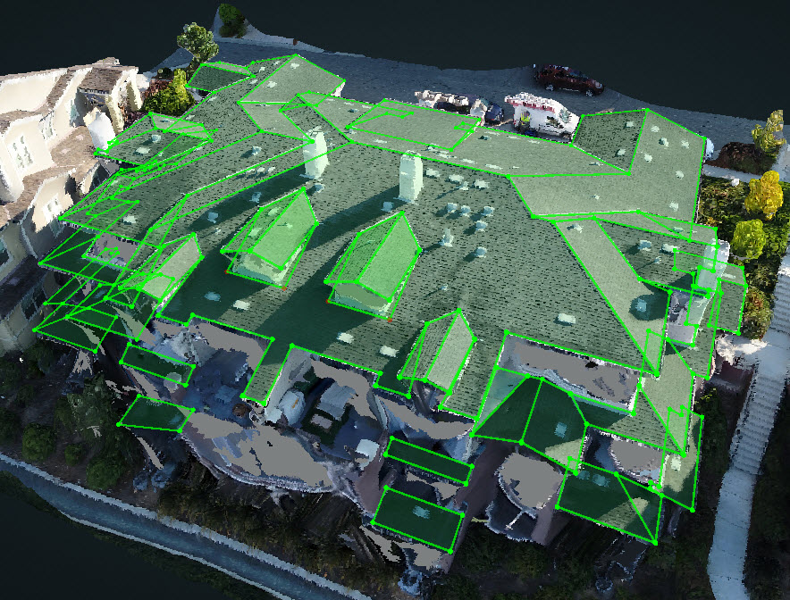
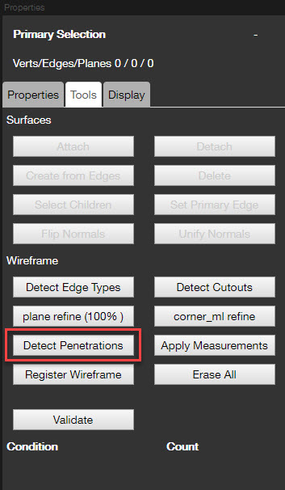
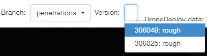
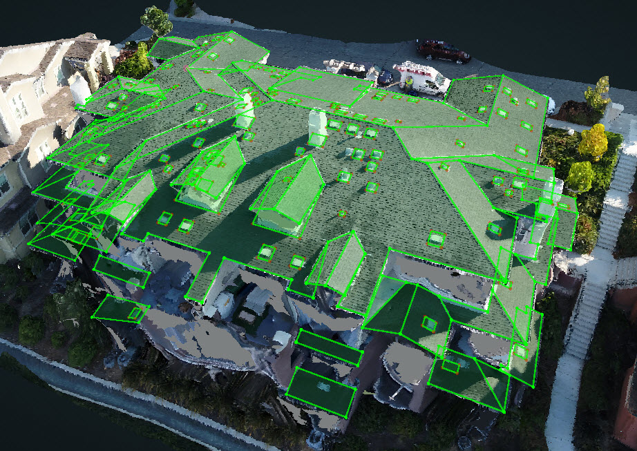

# August 17th 2018

## 📅Weekend Schedule - Beta

Since there are not any reviewers available over the weekend in the new production schedule, so we are going to implement a new schedule to cover the projects during the weekend.


US Team - Everyone is required to fill their availability before they take off on Friday. Please put "X" into the cell when you are **NOT available** over this weekend.


Open the link here 🚩 🚩 🚩 [https://docs.google.com/spreadsheets/d/17SjPC3CaxbrXNMWA-V3gs5UWG\_AlW-YGExpqLdkq2LA/edit?usp=sharing](https://docs.google.com/spreadsheets/d/17SjPC3CaxbrXNMWA-V3gs5UWG_AlW-YGExpqLdkq2LA/edit?usp=sharing)

When you are available, please check the queue to make sure there are not any `Past_Due` projects. If there are too many projects in the queue, slack everyone in the `Wireframe-SOS` channel to get our attention.

## ⛔Check For Penetrations is set to False by default

Previous: 

`"checkForPenetrations": true` 

Now: 

`"checkForPenetrations": false`


Please make sure all the penetrations are done in the tool.


## 🔧Penetration Detection - Beta

Once the roof structure is done.

The Detect Penetration button in the Tools is going to detect all the penetrations automatically.

Under a new Branch called Penetrations, you will see the new version with Penetrations

There might be some extra or missing penetrations and some penetrations may not be very accurate, but it is a good start and Brad 👨‍💻 is working on the improvements.

## 💯The Complete Final Grading Phase of Fawad

The Complete Final grading phase for Fawad is going well, but is still a couple of projects short from being finished. Fawad has submitted 6 Kespry projects and 2 Tesla projects, he still needs to submit 2 standard DD projects to fill the 10 project requirement. There have not been a lot of standard DD projects submitted during his shift so we may need to substitute those for two other projects. Rose and Katherine have completed the grading for four of Fawad's projects and so far he is doing great! His final scores for those projects are listed below. Keep up the good work Fawad! 

| Project ID | Customer | Grader | Reviewer | Grade |
| :--- | :--- | :--- | :--- | :--- |
| 13148 | Kespry | Rose | Katherine | 85.29 |
| 13199 | Kespry | Rose | Katherine | 86.61 |
| 13261 | Kespry | Katherine | Rose | 92.97 |
| 13262 | Kespry | Katherine | Rose | 89.52 |

