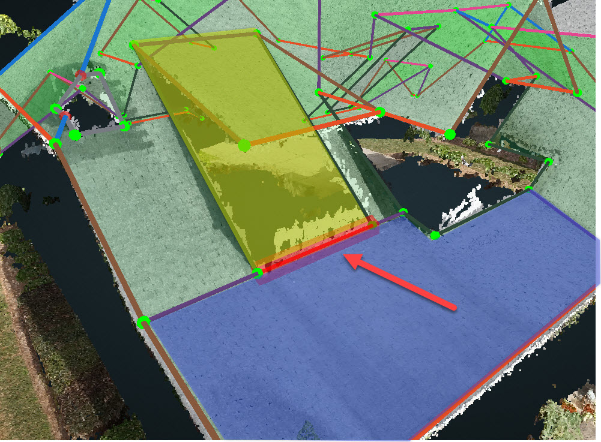

# Cutout Standard From Kespry

### The edge of an attached cutout **CAN NOT** be shared by the other plane.

Assume that the yellow plane is an attached cutout, and the red edge in the picture is shared by the blue plane. This situation will not pass the Kespry GeoJson check phase and will be sent back.


The quick solution is to delete the attached cutout plane.



The final solution is to implement their check.py into our pipeline.


### The edge of an attached cutout **CAN NOT** be shared by the other cutout.

There are two different cases:

1. There are two penetrations on opposite sides of a ridge and from the 2D images it is evident that the best way to handle them is to have them share the edge \(i.e. that portion of the ridge becomes the common edge between them\).

   Typically, we deliberately separate them a little \(bearing a slight loss in accuracy\) so that they don't share the edge, like in the following picture:

   

2. A chimney is split up by a Hip.

   Instead of following the penetration rule,

   

   the best way to handle this type of chimney is to delete the plane.

   

