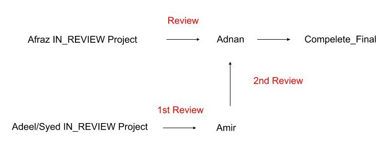
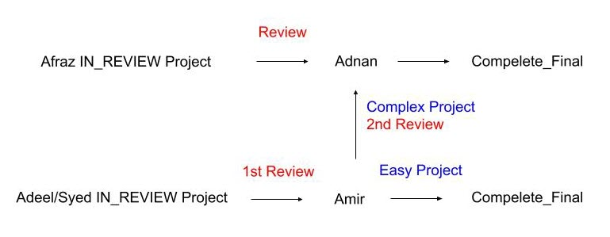

# July 19th 2018

## 💯The Complete Final Grading for Afraz

One more Kespry and two more standard DroneDeploy are remaining from Afraz. Once we receive the projects, we will make the decision and release the grade.

## 🏫Training for Zeeshan and Hamza

PK: Please update the training progress here.

## 📐Penetrations Annotations

PK: Please update the workflow here.

## 🆕New Training Program Pipeline is Created

Katherine and Tianze have truncated our previous training planning and created a new simple version of the training program which only takes around two days.

This basic version of training program aims at the new people who would like to get a feeling of our wireframe tool, but not to join the QA team or focus on the QA progress.

Advanced training program: [https://docs.google.com/presentation/d/1TZHa6eafNztrUlCIFb9UmHZ9jpFpEkKUL9Bdsvy3PZI/edit?usp=sharing](https://docs.google.com/presentation/d/1TZHa6eafNztrUlCIFb9UmHZ9jpFpEkKUL9Bdsvy3PZI/edit?usp=sharing)

Basic training program:   
[https://docs.google.com/presentation/d/1e6ATzDWLzkL80-X0atojxezXr1pNWvN6pzXeS\_KOeTM/edit?usp=sharing](https://docs.google.com/presentation/d/1e6ATzDWLzkL80-X0atojxezXr1pNWvN6pzXeS_KOeTM/edit?usp=sharing)

## 🔄PK Review Pipeline Update

🌑 Before:

🌕 After

