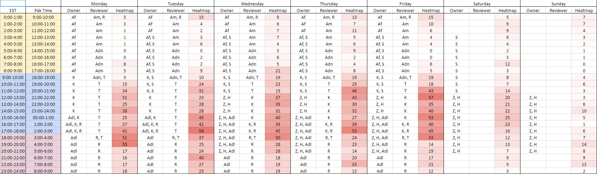

# July 19th 2018

## 💯The Complete Final Grading for Afraz

One more Kespry and two more standard DroneDeploy are remaining from Afraz. Once we receive the projects, we will make the decision and release the grade.

## 🏫Training for Zeeshan and Hamza

Zeeshan and Hamza training have been going good. They still have to few more projects to complete. They will take the quiz next week and after that their status will be changed to Advanced\_user. They will be able to take projects from prod hopefully by the mid/end of next week i.e. July 23 week. 

Open the link here  🚩[https://docs.google.com/spreadsheets/d/1R7C8pRbjcRggceQx2Je6ztOGjrbhn1jT6\_BKx8hy9u8/edit?usp=sharing](https://docs.google.com/spreadsheets/d/10FBFwuX2iVCXaUvKzZs4FcbPDx8bv2u2bvVMMIZf69I/edit?usp=sharing)

## 📐Penetrations Annotations

The penetration annotations will be done on prod projects which already have penetration labeled or needs to be labeled. We will start our annotations with commercial building. The labeled penetrations will be used to train a model for penetrations detection. In penetration annotations, we will add labels for all penetrations. We have currently defined 7 label categories. 

#### Label Categories 

* ac 
* pipe 
* vent 
* dish 
* cable 
* chimney 
* unknown

The penetration annotations will be done after project queue is empty. The QA persons will follow the instructions below. Brad also created a short video as shown in link below. 

### Instructions

* Make sure the structure type is set correctly
* Open the QA wireframe for a project from the list.
* Enter your name as Annotator and the date on which you completed that project
* Click on saveas
* Enter Name: _Annotations_
* Click on Branch and enter _penetrationAnnotation_
* Click save. Now you will be on _penetrationAnnotation_ branch
* If the project doesn't have penetrations labelled, label all penetrations
* Do Following for all penetrations
  * Make sure penetration is tightly marked 
  * Go to Surface Mode -&gt; Click on penetration 
  * Go to _Properties -&gt; Add property -&gt; Custom Text_ 
  * Create _Penetration_ property once. 
  * Penetration property will be available as a drop down menu for all other penetrations 
  * Choose one of the '_**Label categories**_' 
  * Make sure you enter the spelling correctly because it will be later used to retrieve penetrations
  * Repeat for all penetrations 
* Save the _project - penetrationAnnotation_ branch.

Video Link 🚩[https://docs.google.com/spreadsheets/d/1Cvws8nNSY8V0ejgG8Eq18BtWHVoDBPD\_dU7UcLf35x8/edit?usp=sharing](https://www.screencast.com/t/xXnee99gM)

Open the labeling sheet here    🚩[https://docs.google.com/spreadsheets/d/1Cvws8nNSY8V0ejgG8Eq18BtWHVoDBPD\_dU7UcLf35x8/edit?usp=sharing](https://docs.google.com/spreadsheets/d/1Cvws8nNSY8V0ejgG8Eq18BtWHVoDBPD_dU7UcLf35x8/edit?usp=sharing)

## 🆕New Training Program Pipeline is Created

Katherine and Tianze have truncated our previous training planning and created a new, simpler version of the training program which only takes around two days.

This basic version of the training program is aimed toward the new people who would like to get a feeling of our wireframe tool, but not to join the QA team or focus on the QA progress.

Advanced training program: [https://docs.google.com/presentation/d/1TZHa6eafNztrUlCIFb9UmHZ9jpFpEkKUL9Bdsvy3PZI/edit?usp=sharing](https://docs.google.com/presentation/d/1TZHa6eafNztrUlCIFb9UmHZ9jpFpEkKUL9Bdsvy3PZI/edit?usp=sharing)

Basic training program:  
[https://docs.google.com/presentation/d/1e6ATzDWLzkL80-X0atojxezXr1pNWvN6pzXeS\_KOeTM/edit?usp=sharing](https://docs.google.com/presentation/d/1e6ATzDWLzkL80-X0atojxezXr1pNWvN6pzXeS_KOeTM/edit?usp=sharing)

## 🔄PK Review Pipeline Update

🌑 Before:

🌕 After

## 📅Production Schedule - Alpha

Open the link here   🚩 🚩 🚩[https://docs.google.com/spreadsheets/d/1R7C8pRbjcRggceQx2Je6ztOGjrbhn1jT6\_BKx8hy9u8/edit?usp=sharing](https://docs.google.com/spreadsheets/d/1R7C8pRbjcRggceQx2Je6ztOGjrbhn1jT6_BKx8hy9u8/edit?usp=sharing)

I have setup the production schedule and all of the QA people's availabilities have been under consideration. It is planned to go into effect the week after next week, starting from July 30th, Monday.

For sure, hopefully, Zeeshan and Hamza are ready for the production projects before that date😁.

It is still the alpha version and open to all of your opinions. A lot of changes will be made based on all of your opinions next week.

1. Each workday is divided into three sections, Yellow \(0:00 - 10:00\), Blue \(9:00 - 19:00\) and Red \(18:00 - 01:00\). Between each section, there is a 1-hour overlapping period which is owned by two reviewers. That transfer period is very important and the two reviewers need to coordinate with each other to let the other one know what has been done and what needs to be done.

   

2. Reviewer does not only have the responsibility to review the project, it is also required for him to take projects when the queue is filled up with projects. 
3. Changes:   

   @Adeel: You are probably the one who has the most significant change, since your availability is said 0:00-24:00, so we changed your schedule to fit into our daytime. Let me know if you have any questions, but we would be happy if you could work with us together and we will review your wireframe to give you direct feedback.  
  
   @Syed: We pushed your working hour for around 3 hours, but it is said you will be available 0:00-12:00, so I assume it should not be a problem for you. We also changed you from Monday-Friday to Tuesday-Saturday, since we do need some people to fill the gaps over the weekends.  
  
   @Zeeshan and @Hamza: Your working hour is set to 12:00 - 21:00 from Wednesday to Sunday. Let me know if you have any questions.


We value your feedback and welcome any comments you may have to help improve the QA schedule. Please make sure to let me know any opinion you may have before the end of next week and we will take it into consideration.


