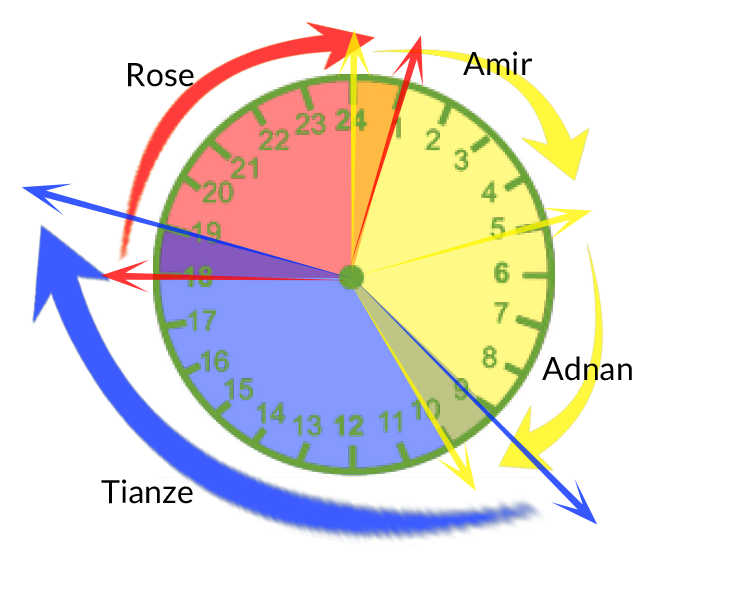

# July 19th 2018

## 💯The Complete Final Grading for Afraz

One more Kespry and two more standard DroneDeploy are remaining from Afraz. Once we receive the projects, we will make the decision and release the grade.

## 🏫Training for Zeeshan and Hamza

PK: Please update the training progress here.

## 📐Penetrations Annotations

PK: Please update the workflow here.

## 🆕New Training Program Pipeline is Created

Katherine and Tianze have truncated our previous training planning and created a new simple version of the training program which only takes around two days.

This basic version of training program aims at the new people who would like to get a feeling of our wireframe tool, but not to join the QA team or focus on the QA progress.

Advanced training program: [https://docs.google.com/presentation/d/1TZHa6eafNztrUlCIFb9UmHZ9jpFpEkKUL9Bdsvy3PZI/edit?usp=sharing](https://docs.google.com/presentation/d/1TZHa6eafNztrUlCIFb9UmHZ9jpFpEkKUL9Bdsvy3PZI/edit?usp=sharing)

Basic training program:  
[https://docs.google.com/presentation/d/1e6ATzDWLzkL80-X0atojxezXr1pNWvN6pzXeS\_KOeTM/edit?usp=sharing](https://docs.google.com/presentation/d/1e6ATzDWLzkL80-X0atojxezXr1pNWvN6pzXeS_KOeTM/edit?usp=sharing)

## 🔄PK Review Pipeline Update

🌑 Before:

🌕 After

## 📅Production Schedule - Alpha

[https://docs.google.com/spreadsheets/d/1R7C8pRbjcRggceQx2Je6ztOGjrbhn1jT6\_BKx8hy9u8/edit?usp=sharing](https://docs.google.com/spreadsheets/d/1R7C8pRbjcRggceQx2Je6ztOGjrbhn1jT6_BKx8hy9u8/edit?usp=sharing)

I have setup the production schedule and all the QA people's availabilities have been under consideration. It is planned to go to effect the week after next week, starting from July 30th, Monday. 

For sure, hopefully, Zeeshan and Hamza are ready for the production projects before that date😁.

It is still the alpha version and open to all of your opinions, a lot of changes will be made based on all your opinions next week.

1. Each workday is divided into three sections, Yellow \(0:00 - 10:00\), Blue \(9:00 - 19:00\) and Red \(18:00 - 01:00\). Between each section, there is a 1-hour overlapping period which is owned by two reviewers. That transfer period is very important and the two reviewers need to coordinate with each other to let the other one know what has been done and what needs to be done.

   

2. Reviewer does not only have the responsibility to review the project, it is required for him to take projects when the queue is filled up with projects. 
3. Changes:   
   @Adeel: You probably are the one who has the most significant change, since your availability is said 0:00-24:00, so we changed your schedule to fit into our daytime. Let me know if you have any questions, but we would be happy if you could work with us together and we will review your wireframe to give you directly feedback.

  
   @Syed: We pushed your working hour for around 3 hours, but it is said you will be available 0:00-12:00, so I assume it should not be a problem for you. We also changed you from Monday-Friday to Tuesday-Saturday, since we do need some people to fill the gaps over the weekends.

  
   @Zeeshan and @Hamza: Your working hour is set to 12:00 - 21:00 from Wednesday to Sunday. Let me know if you have any questions.

We value your feedback and welcome any comments you may have to help improve the QA schedule. Please make sure to let me know any opinion you may have before the end of next week and we will take it into consideration.

