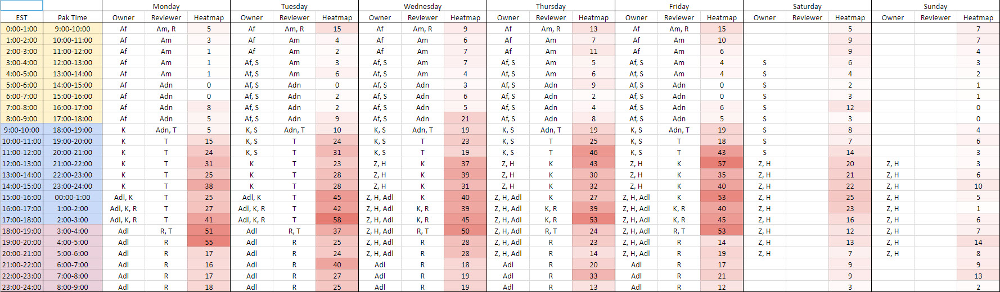
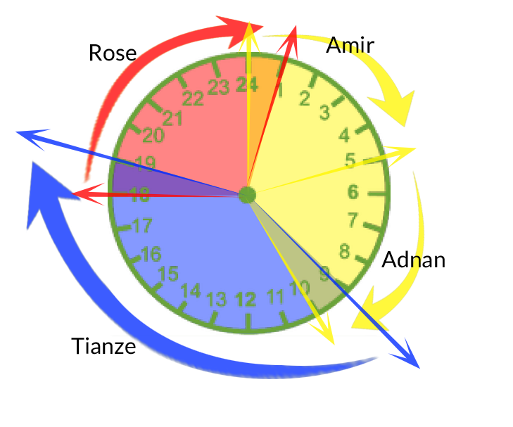
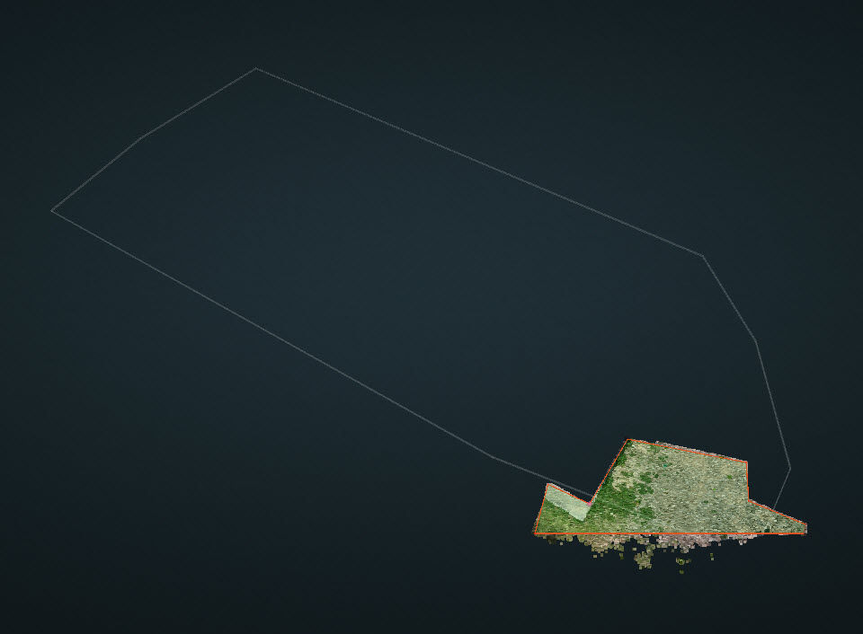
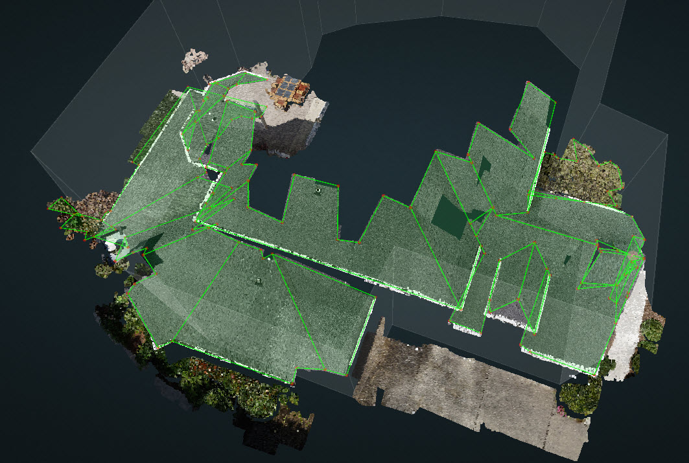
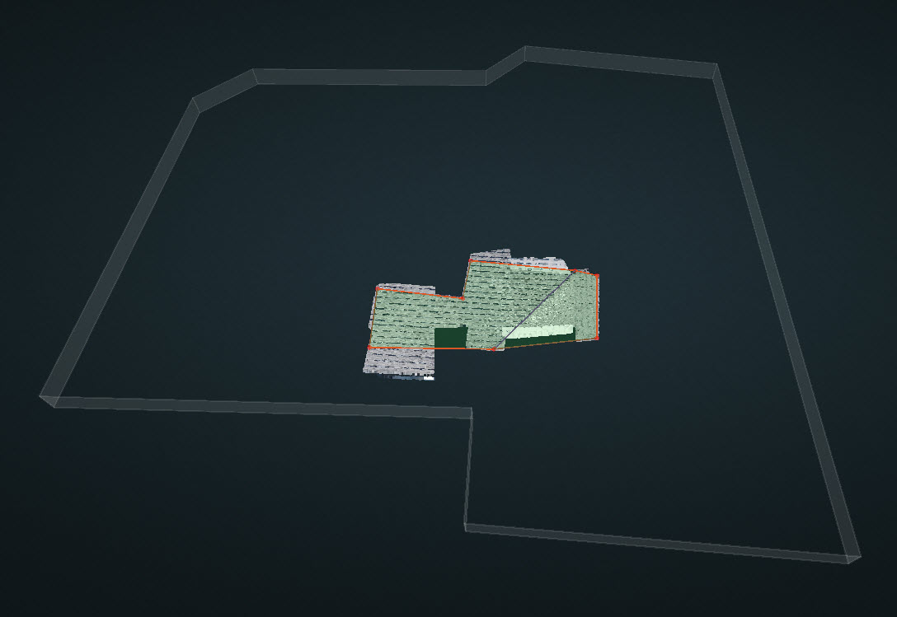
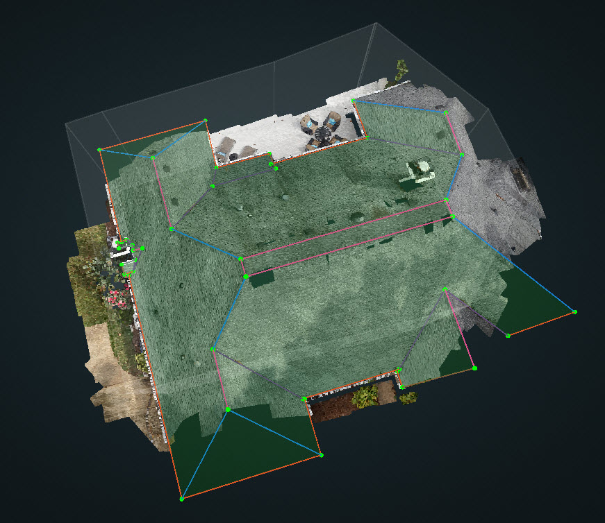
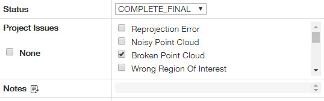
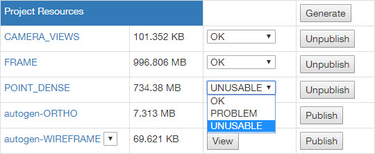

# July 27th 2018

## 💯The Complete Final Grading for Afraz

Thanks for **Rose**👩 and **Tianze**🧑, they have finished grading all the remaining projects from **Afraz**.

| Project ID | Customer | Grader | Reviewer | Grade |
| :--- | :--- | :--- | :--- | :--- |
| 11500 | Kespry | Tianze | Rose | 78.65 |
| 11501 | Kespry | Tianze | Rose | 72.14 |
| 11502 | Kespry | Rose | Tianze | 89.90 |
| 11572 | Tesla | Tianze | Rose | 85.97 |
| 11629 | Kespry | Tianze | Rose | 89.68 |
| 11781 | Tesla | Tianze | Rose | 83.55 |
| 11883 | Kespry | Rose | Tianze | 75.15 |
| 11977 | Kespry | Tianze | Rose | 89.06 |
| 11984 | DD | Tianze | Rose | 79.68 |
| 12052 | DD | Rose | Tianze | 68.00 |
|  |  |  | DroneDeploy Average | 79.30 |
|  |  |  | Kespry Average | 82.43 |
|  |  |  | Total Average | 81.18 |

📑 The detailed gradings could be found at [here.](https://docs.google.com/spreadsheets/d/18hYex09FSQzJUyOKFiIXiJkYAuo9PdqV6dYNS7FKaBQ/edit?usp=sharing)

Since Afraz's average score is 81.18, which is greater than 80, so I would like to say Congratulation to him first. However, the average score of the DD projects \(including the Tesla and the standard ones\) is only 79.68 which is lower than 80, which means he made more mistakes on the DD projects.

🎆🎇Per the discussion of the grade team, we reached an agreement to qualify him for the **Kespry projects**.🎉🎊

But for the **DroneDeploy** ones, more practice and carefulness are needed. We need to remember accuracy and quality always come first and we do not want our customer to find out our mistakes.

**Grader Feedback:**

**Tianze**🧑:

You may need to balance the timing and quality better. Since sometimes you lost a lot of points on the timing part, however, some other times you lost some points on the extra vertices. So don't waste your time on the difficult part and focus on the main part of the roof more. Besides, a lot of vertices locations are not very accurate. I know we rely on the AutoLock but please make sure the plane is correct before you lock it and double check the corners of the roof if you feel not very confident.  
Cheer up! We will regrade your DD projects after one month and hopefully you will become fully qualified at that time!

**Rose**👩:

First off, congratulations on Kespry! You put a lot of hard work into your training and it shows!  
You have the bulk of the DD procedures down, it's just the little things that get points knocked off- and unfortunately, the little things can build up 😔. Keep an eye on the measurements and symmetry between rakes and hips. Check on the vertexes, ensure they're on/in their corners- and that they're touching the correct plane.  
I'm positive that by next month, you'll be there! 👍

## 🏫Training for Zeeshan and Hamza

Zeeshan and Hamza took the 1st quiz on July 23rd, but unfortunately, they both failed on the quiz.

They took the 2nd quiz on July 26th and they both passed!! 👍 🙌 🙌

🎉🎉Congratulations to Zeeshan and Hamza 🎈🎈. They both did a great job on the quiz and they are allowed to start picking up projects in the queue officially and change the status to `IN_REVIEW` from now on.

## 📅Production Schedule

Open the link here 🚩 🚩 🚩[https://docs.google.com/spreadsheets/d/1R7C8pRbjcRggceQx2Je6ztOGjrbhn1jT6\_BKx8hy9u8/edit?usp=sharing](https://docs.google.com/spreadsheets/d/1R7C8pRbjcRggceQx2Je6ztOGjrbhn1jT6_BKx8hy9u8/edit?usp=sharing)

I have setup the production schedule and all of the QA people's availability have been under consideration. It will go into effect next week officially, starting from July 30th, Monday.

It is in the beta version and some changes will be made in the future.

Each workday is divided into three sections, **Yellow \(0:00 - 10:00\), Blue \(9:00 - 19:00\) and Red \(18:00 - 01:00\)**. Between each section, there is a 1-hour overlapping period which is owned by two reviewers. That transfer period is very important and the two reviewers need to coordinate with each other to let the other one know what has been done and what needs to be done.

Reviewer does not only have the responsibility to review the project, it is also required for him to take projects when the queue is filled up with projects.


We value your feedback and welcome any comments you may have to help improve the QA schedule. Please let me know any opinions you may have anytime and we will take it into consideration.


## 📅Weekend Schedule - Alpha

Thank Zeeshan, Hamza, Adeel and Fawad for working over this weekend in advance.

Since there are not any reviewers available over the weekend in the new production schedule, so we are going to implement a new schedule to cover the projects during the weekend soon.

We will use a temporary solution this weekend to track the performance. Changes will be made next week to get a better plan.


US Team - Everyone is required to fill their availability before they take off on Friday. Please put "X" into the cell when you are **NOT available** over this weekend.


Open the link here 🚩 🚩 🚩  
[https://docs.google.com/spreadsheets/d/17SjPC3CaxbrXNMWA-V3gs5UWG\_AlW-YGExpqLdkq2LA/edit?usp=sharing](https://docs.google.com/spreadsheets/d/17SjPC3CaxbrXNMWA-V3gs5UWG_AlW-YGExpqLdkq2LA/edit?usp=sharing)

When you are available, please check the queue to make sure there are not any `Past_Due` projects. If there are too many projects in the queue, slack everyone in the `Wireframe-SOS` channel to get our attention.

## 📄Review Workflow

We are going to have two more columns on the intranet, which are Reviewer and Review Time, to track the performance of the reviewers.

Before that, a temporary solution, all the reviewers - please assign the project to yourself when you start reviewing a project. Then the other reviewers will know that you are reviewing that project.

But, please remember to assign the project back to the owner after the review.🔙

## 🆘Ask for Help!

We have setup a new channel called **Wireframe-SOS** for everyone and it aims to get everyone's attention when there are too many projects in the queue. All the project owners, especially the reviewer during that time have the responsibility to let everyone know and ask for help when the queue is filled up with projects.

Example:


SOS! There are 10 past due projects in the queue right now and our QA team could not handle that many. Please get online and pick 1 or 2 project if you are available.


## 🔍How to deal with Broken Point Cloud

Kespry is doing testing flights on site by the pilot sometimes, and they are not expecting any results from this kind of testing projects. There is no need to put these broken point cloud to `IN_REVIW` or `IN_SUPPORT`, since they could be done easily.

**Case 1:** Ground/Dirt/Grass without any structures.

**Example:** `12243`

**Solution:** Typically, the autogen is empty since no structures are detected. So please draw a rectangle on the ground and publish. There is no need to worry about the edge types since they do not make any sense.

**Case 2:** Most of the roofing is not captured.

**Example:** `12198, 11872`

**Solution:** Typically, there will be an autogen branch although the autogen wireframe is a little broken or messy. What you need to do is to save the autogen into qa branch and publish the wireframe which generated automatically. Again, there is no need to worry about the edge types since they do not make any sense.

**Case 3:** Part of the roofing is not captured.

**Example:** `11808`

**Solution:** Take it as a regular project, but ignore the uncompleted planes. Do not waste your time on the corners which are not shown on any cameras.


Always remember to check the _**Broken Point Cloud**_ before you publish the project.


For **Case 1 and Case 2** where there are not any completed planes, change the `POINT_DENSE` to `UNUSABLE`.

For **Case 3** where there are several completed planes, change the `POINT_DENSE` to `PROBLEM`.

However, for the broken DroneDeploy projects or some unexpected Kespry projects, please follow our previous steps here.

[https://pointivo.gitbook.io/user-guide/weekly-updates/jun-20th-2018\#in\_support-status](https://pointivo.gitbook.io/user-guide/weekly-updates/jun-20th-2018#in_support-status)

