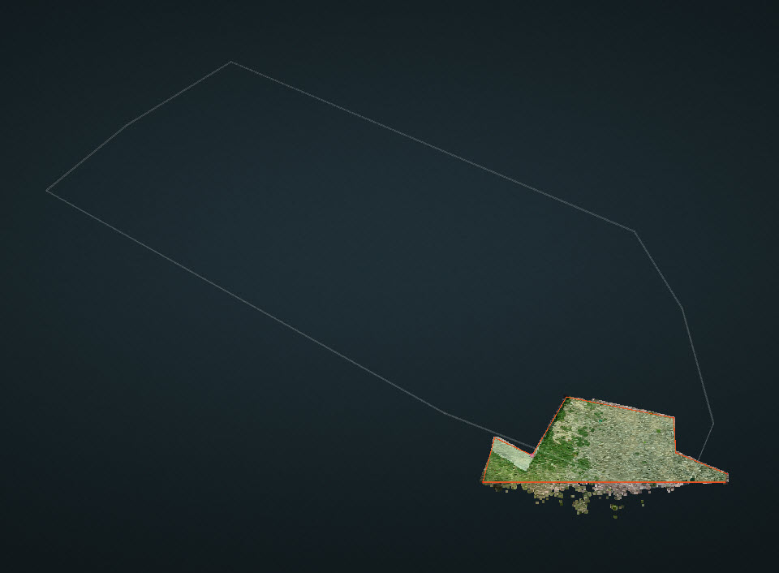
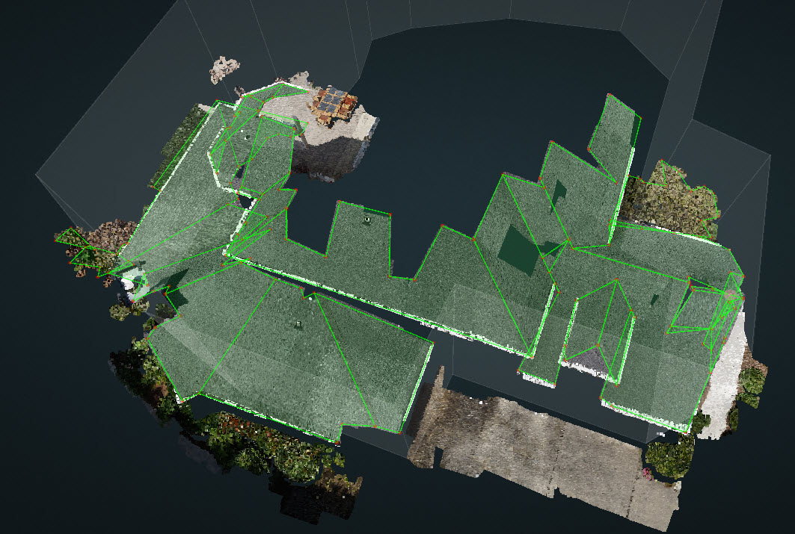
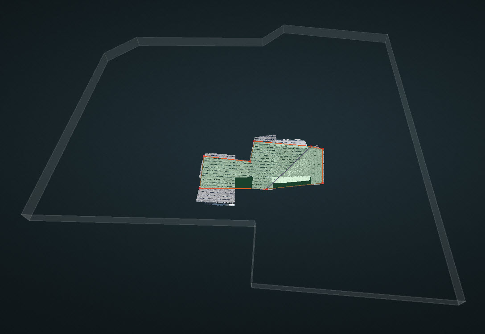
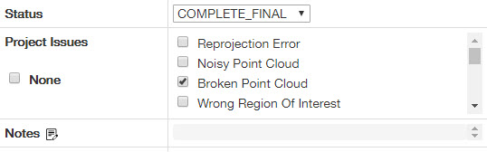
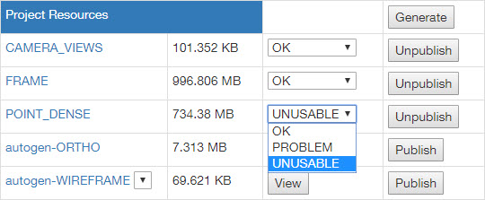

# How to deal with Broken Point Cloud

Kespry is doing testing flights on site by the pilot sometimes, and they are not expecting any results from this kind of testing projects. There is no need to put these broken point cloud to `IN_REVIW` or `IN_SUPPORT`, since they could be done easily.

**Case 1:** Ground/Dirt/Grass without any structures.

**Example:** `12243`

**Solution:** Typically, the autogen is empty since no structures are detected. So please draw a rectangle on the ground and publish. There is no need to worry about the edge types since they do not make any sense.

**Case 2:** Most of the roofing is not captured.

**Example:** `12198, 11872`

**Solution:** Typically, there will be an autogen branch although the autogen wireframe is a little broken or messy. What you need to do is to save the autogen into qa branch and publish the wireframe which generated automatically. Again, there is no need to worry about the edge types since they do not make any sense.

**Case 3:** Part of the roofing is not captured.

**Example:** `11808`

**Solution:** Take it as a regular project, but ignore the uncompleted planes. Do not waste your time on the corners which are not shown on any cameras.


Always remember to check the _**Broken Point Cloud**_ before you publish the project.


For **Case 1 and Case 2** where there are not any completed planes, change the `POINT_DENSE` to `UNUSABLE`.

For **Case 3** where there are several completed planes, change the `POINT_DENSE` to `PROBLEM`.

However, for the broken DroneDeploy projects or some unexpected Kespry projects, please follow our previous steps here.

[https://pointivo.gitbook.io/user-guide/weekly-updates/jun-20th-2018\#in\_support-status](https://pointivo.gitbook.io/user-guide/weekly-updates/jun-20th-2018#in_support-status)

