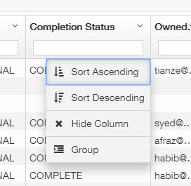
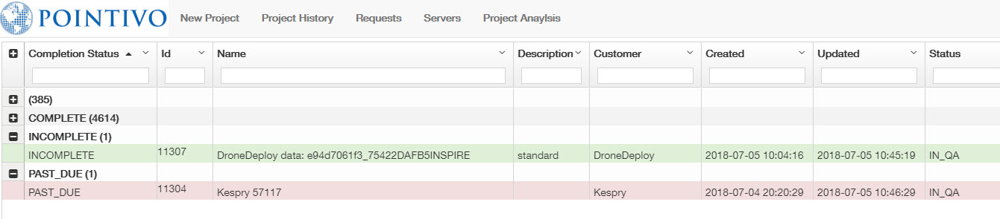
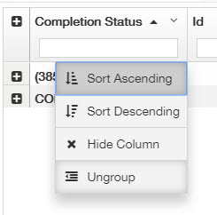

# July 6th 2018

## 🔝Project Priority and Intranet Tips

**Project Priority:** Old projects have the higher priority than the new projects. Past Due projects have the higher priority than the Warning or In QA projects.

Based on this, when you get online and check the project queue, please make sure you pick the oldest Past Due project first. As you know, it is easy to Search or Sort the projects via the Intranet view, but you could also Group the projects to check the projects with different status more clearly.

You could Group the projects by any columns but Group by the Completion Status is going to help you a lot.

Then you will see each project by different Completion Status and I would suggest to open the PAST\_DUE list and pick up the oldest one.

If you want to go back to the default view, just Ungroup the column.

## 🚫Manually Deleted/Created Planes are not saved after reopen the project.

Once you close the project, your manually deleted or created planes are not going to be saved inside the project.

When you reopen the project or someone else open the project on different computers, the wireframe tool is going to turn on the Auto Plane mode and reload all the planes.


All your previous planes will be lost!


## 📢Weekly Update from Pakistan coming soon in next week

I am going to share the write permission of the user guide with **Amir**🧔 and **Adnan**👨‍ next week. Since we would like to know what is happening on their side as well, and in this way, they are able to make some updates like the training progress by themselves.

## 💯The Complete Final Grading Phase of Kathrine and Afraz are going to start next Monday

We have setup the Grading Guide, some testing has been done on our end to make sure it is going to work as expected.


I would highly recommend every grader and examinee take a look at the Grading Guide to make sure you totally understand the grading rules.  


Grading Guide: [https://docs.google.com/spreadsheets/d/18hYex09FSQzJUyOKFiIXiJkYAuo9PdqV6dYNS7FKaBQ/edit?usp=sharing](https://docs.google.com/spreadsheets/d/18hYex09FSQzJUyOKFiIXiJkYAuo9PdqV6dYNS7FKaBQ/edit?usp=sharing)

| Examinee | Grader |
| --- | --- |
| **Katherine**  👧 | **Amir**🧔 and **Adnan**👨‍ |
| **Afraz** 👽 | **Rose**👩 and **Tianze**🧑 |

Grader Rules:

1. As shown above, to be fair, trainer could not grade his trainee.
2. Only grader has the write permission of the grade sheet but examinee could see his/her score anytime.
3. Since there are some criteria which are up to the grader's personal standards, so examinee has the right to argue the score with the grader anytime when he/she feels unfair. When examinee provide reasonable evidence, Grader Team should discuss to reach an agreement that the petition is either rejected or accepted.
4. Grader should fill up the grade sheet carefully and provide detailed explanation for every deducted point.
5. To track the projects which need to be graded, each time the examinee's project is ready for review, please say `"10000 ready for review, version 100000 ready for grade"` in the wireframe channel. The project should be reviewed as regular, and the grader needs to pick up the IN\_REVIEW version when he starts grading the project.
6. Some huge projects are not under consideration for grading, Grade Team will make the decision whether the project is an exception or not.
7. Grading is going to start from next Monday and grader is going to grade the first 10 projects which owned by the examinee. Ideally, there should be 6 Kespry projects, 2 Standard DroneDeploy projects and 2 Label Obstruction projects.
8. Grade Team reserves the right of final decision on the interpretation of these Terms and Conditions.😎

## ✅2D image adjustment of Penetration is working right now

You should be able to adjust any anchor point of a cutout via 2D images and the entire workflow of the Penetration page has been updated as the following.



