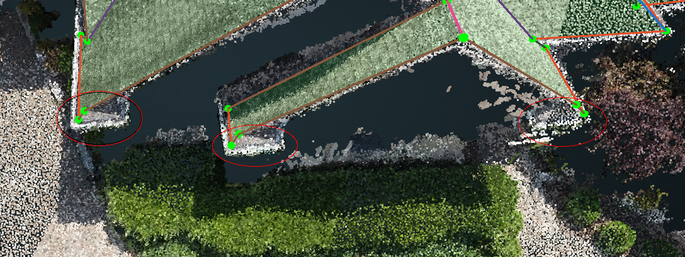

# Jun 20th 2018

## Vertical Planes

```text
Re Adnan's 
1) Please always remember to delete the vertical planes
```

A Vertical Plane is defined as a plane whose slope is greater than 80 degrees. You can select the plane in the tool and go to the properties to check the Slope number, and see if it will be detected.

Vertical Planes are going to be **neglected** automatically during the Detect Edge Types and Generate GeoJson. So you can imagine that there is not going to be any difference between you deleting the planes in the 3Dtool, or just leaving them to be neglected in the GeoJson generation.

But, we still highly recommend to Delete the Vertical Planes in the 3Dtool since our workflow may not delete a plane with 79 degrees, even though you definitely want it to be deleted. It is always much safer to visualize everything in the tool instead of assuming something will be fixed automatically.

## Dormer Cutouts

```text
Re Adnan's 
2) Dormer cutouts are not required to be done in the wireframe. 
They are automatically detected at the time of geojson generation.
```

Although dormer cutouts are automatically detected at the time of GeoJson generation, they are still **required** to be done in the 3Dtool. Again, there might not be any difference between detecting it in the tool versus letting it get detected automatically during the GeoJson generation. However, if you do it in the 3Dtool, you get to see what the cutouts will look like and you can check, or even adjust, the location of the new cutout vertices.

Besides, if you do the cutout detection in the 3Dtool, all of the new vertices will be red and you will need to make sure that there are not any extra unwanted red vertices after the detection. If there are, go to the Settings in the intranet and turn off the "performcutout" setting:

From

```text
   "performCutout": true
```

To

```text
   "performCutout": false
```

## Chimneys

```text
Re Adnan's 
Please note that chimney cutouts are still needed to be done in the wireframe and you did them right.
```

We recently discussed this question, so please follow the new rule:

| Customer | Location | Do or Do not |
| --- | --- | --- |
| Kespry | In the middle of an edge | Do |
| Kespry | In the middle of a Plane | Do not |
| DroneDeploy | In the middle of an edge | Do |
| DroneDeploy | In the middle of a Plane | Do |
| DroneDeploy with Label Obstruction | In the middle of an edge | Do |
| DroneDeploy with Label Obstruction | In the middle of a Plane | Do |

## Small Areas

```text
Re Adnan's 
You missed out some small areas as shown in the below image.
```



Do not bother with these kinds of small areas, unless they are reconstructed extremely well.

## In\_Support Status

When you think a project has some issues, instead of marking the project as In\_Support directly, please do the following:

1. Assign the project to tianze@pointivo.com
2. Describe the detailed issues in the wireframe channel and tag @tianzem.
3. Change the project to IN\_REVIEW so that we do not miss the Nagbot notification.

