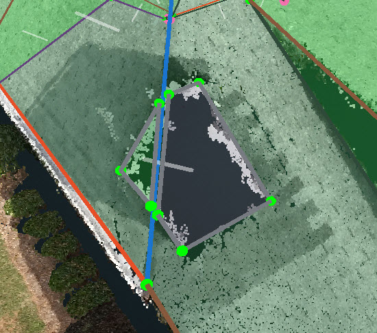

# Jun 29th 2018

## ⏰Schedule Changes

🎉🎉Congratulations to Adeel and Fawad🎈🎈. They both did a great job on the quiz and they are allowed to start to pick the projects in the queue officially and change the status to `IN_REVIEW` from now on.

QA Team Schedule in Pakistan

**Afraz:** From 0:00 to 9:00 in EST \(9:00 to 18:00 Pakistan time\) via Monday to Friday

**Adeel:** From 0:00 to 9:00 in EST \(9:00 to 18:00 Pakistan time\) via Wednesday to Sunday

**Fawad:** From 0:00 to 9:00 in EST \(9:00 to 18:00 Pakistan time\) via Tuesday to Saturday

Based on that, Rose is going to start a little earlier to help us cover the project queue in the afternoon

**Rose:** From 13:00 to 21:00 in EST via Monday to Friday \(Flexible\)

## ❌Scaling Check

Scaling Check has been deprecated and the deprecated instruction has been moved to the ⛔Deprecated section.

## 🐛Register Wireframe

There is a critical bug when you try to register the wireframe. If you save the imported wireframe before clicking register, some layer will disappeaar and never show up.

To avoid it, please do not save the unregistered wireframe until the wireframe is fully registered.


If you still mess it up by mistake, please contact with Shwetank👨‍💻.


## ✨Fresh Looking User Guide

Gitbook has updated the UI, then we followed the instruction and made some significant changes. Hopefully you like it! 👍

So the new link of the user guide is:

[https://pointivo.gitbook.io/user-guide/](https://pointivo.gitbook.io/user-guide/)

And the previous ones:

[https://tianzem.gitbooks.io/pointivo-user-guide/](https://tianzem.gitbooks.io/pointivo-user-guide/)

[https://legacy.gitbook.com/read/book/tianzem/pointivo-user-guide](https://legacy.gitbook.com/read/book/tianzem/pointivo-user-guide)

They may still work, since they are redirecting to the same URL. But I am not going to maintain them anymore.

## ‍🎓Review Standard

| **Reviwer** | **Level** | **Reviewee** | **Time** |
| --- | --- | --- | --- |
| Habib | 🥇 | Anyone | Anytime |
| Adnan | 🥈 | Afraz | 0:00 to 9:00 EST \(9:00 to 18:00 Pakistan time\) |
| Amir | 🥈 | Fawad and Adeel | 0:00 to 9:00 EST \(9:00 to 18:00 Pakistan time\) |
| Tianze | 🥈 | Katherine | 10:00 to 19:00 EST |
| Rose | 🥉 | TBD | TBD |

1. Each reviewer needs to make sure all the `IN_REVIEW` projects are `Complete_Final` by the end of his review time.
2. Reviewer is not restricted to the reviewee, he has the responsibility to review every project during his review time. For example, if Fawad finishes a project during Tianze's review time, Tianze has the responsibility to review that project.
3. If the reviewer feels not confident about reviewing a project, reviewer should hand over the issue to a upper level reviewer.
4. The purpose of reviewing a project is not only to `Complete_Final` the project, also to let the reviewee know the issues then the reviewee may not make the same kind of mistakes anymore. So reviewer needs to post the issues in the wireframe channel and let the reviewee know after review, then reviewee shall go back to fix the issue and let the reviewer review again.
5. Reviewer needs to review the `IN_REVIEW` project as soon as possible, since there are not any differences between `IN_REVIEW` and `IN_QA` from the customer's perspective, and we need to `COMPLETE_FINAL` the project before the deadline.

## ❗Cutout Standard From Kespry

### The edge of an attached cutout **CAN NOT** be shared by the other plane.

Assume the yellow plane is an attached cutout, and the red edge in the picture is shared by the blue plane. This situation could not pass the Kespry geojson check phase and will be sent back.


The quick solution is to delete the attached cutout plane.



The final solution is to implement their check.py into our pipeline.


### The edge of an attached cutout **CAN NOT** be shared by the other cutout.

There are two different cases

1. Two penetrations on opposite sides of a ridge and from images it is evident that the best way to do them is that they share the edge \(i.e. that portion of ridge becomes the common edge between them\)

   Typically, we deliberately separate them apart \(bearing a slight loss in accuracy\) a little so that they don't share the edge, like in the following picture.

   

2. A chimney is split up by a Hip

   Instead of following the penetration rule

   

   But the best way to handle the chimney is to delete the plane.

   

