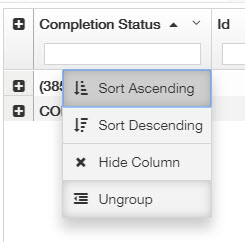

# Project Priority and Intranet Tips

**Project Priority:** Old projects have a higher priority than new projects. Past Due projects have higher priority over the Warning or In\_QA projects.

Based on this, when you get online and check the project queue, please make sure you pick the oldest Past Due project first. As you know, it is easy to Search or Sort the projects via the Intranet view, but you can also Group the projects in order to see the projects with different status more clearly.

You can Group the projects by any of the columns, but Group by the Completion Status is going to help you the most.

Then you will see each project by different Completion Status, and I suggest opening the PAST\_DUE list and picking up the oldest one.

If you want to go back to the default view, just Ungroup the column.

## 

