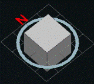
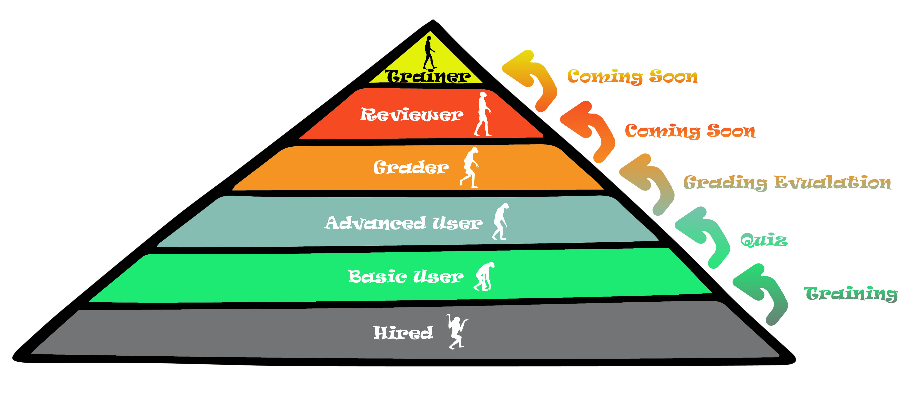

# September 12th 2018

## 📅Weekend Schedule - Beta

Since there are not any reviewers available over the weekend in the new production schedule, so we are going to implement a new schedule to cover the projects during the weekend.


US Team - Everyone is required to fill their availability before they take off on Friday. Please put "X" into the cell when you are **NOT available** over this weekend.


Open the link here 🚩 🚩 🚩 [https://docs.google.com/spreadsheets/d/17SjPC3CaxbrXNMWA-V3gs5UWG\_AlW-YGExpqLdkq2LA/edit?usp=sharing](https://docs.google.com/spreadsheets/d/17SjPC3CaxbrXNMWA-V3gs5UWG_AlW-YGExpqLdkq2LA/edit?usp=sharing)

When you are available, please check the queue to make sure there are not any `Past_Due` projects. If there are too many projects in the queue, slack everyone in the `Wireframe-SOS` channel to get our attention.

## 🔄Update - Output resource types


Except previous **GEOJSON, DXF and DATA\_PACKAGE,** all the new resources are only for internal use, they are not productive resources and please **DO NOT** publish these resources to our customer.


Brief introduction:

ORTHO:

ORTHO-REPORT:

DATAPACKAGE\_JSON:

## 🔄Update - Export function



## 🔄Update - Eraser



## 🔄Update - Validation - Parent/Child Plane Shared Edges



## 🔄Update - Project Issues - Project Type Mismatch



## 🆕New - Images panel



## 🆕New - Inspect Tool

## 🆕New - 3D View Cube

This tool is located in the upper right corner of the 3D viewer. It is a 3D compass that shows where the North direction is located with respect to the current view of the point cloud.

## 🆕New - Total review time

Total review time is available via Intranet, but it is hidden by default. It shows how long the project stays in the IN\_REVIEW status, instead of how long the reviewer spends reviewing the project.

## 🗼 Hierarchy Pyramid

## 💯The DroneDeploy Complete Final Grading Phase of Afraz

Thanks for **Rose** 👩 and **Katherine** 👧, they have finished grading all remaining projects from **Afraz**.

| Project ID | Customer | Grader | Reviewer | Grade |
| :--- | :--- | :--- | :--- | :--- |
| 14741 | Tesla | Katherine | Rose | 99 |
| 14821 | Tesla | Katherine | Rose | 87 |
| 14585 | Tesla | Rose | Katherine | 92 |
| 14698 | DroneDeploy | Rose | Katherine | 81.7 |
|  |  |  | DroneDeploy Total Average | 89.9 |

📑 The detailed grades could be found at [here.](https://docs.google.com/spreadsheets/d/18hYex09FSQzJUyOKFiIXiJkYAuo9PdqV6dYNS7FKaBQ/edit?usp=sharing)

🎆🎆🎇🎇 I am more than happy to announce that **Afraz** has passed the DroneDeploy grading period and is qualified for Complete\_Final all the projects without Review. 🎉🎉🎊🎊

## 💯The Complete Final Grading Phase of Adeel is going to start from next Monday


I would highly recommend every grader and examinee take a look at the Grading Guide to make sure you totally understand the grading rules before the final evaluation officially starts.


Grading Guide: [https://docs.google.com/spreadsheets/d/18hYex09FSQzJUyOKFiIXiJkYAuo9PdqV6dYNS7FKaBQ/edit?usp=sharing](https://docs.google.com/spreadsheets/d/18hYex09FSQzJUyOKFiIXiJkYAuo9PdqV6dYNS7FKaBQ/edit?usp=sharing)

| Examinee | Grader | Supervisor |
| :--- | :--- | :--- |
| **Adeel** | **Afraz** and **Fawad** | **Rose** and **Katherine** |

Afraz's and Fawad's grading experience will be evaluated as well, it will be taken as a reference of whether they are qualified for Reviewer in the near future.

Grade Standard:



