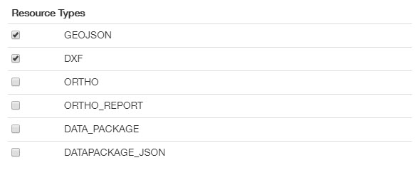
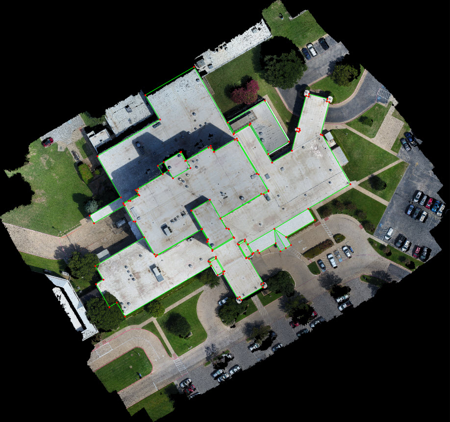
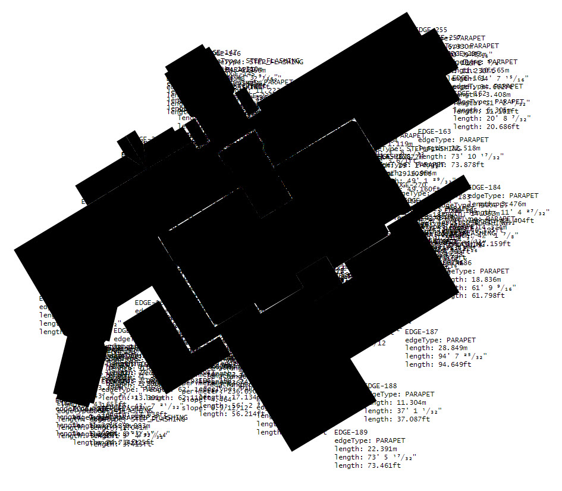
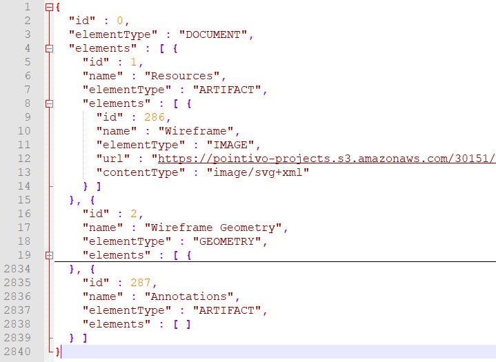
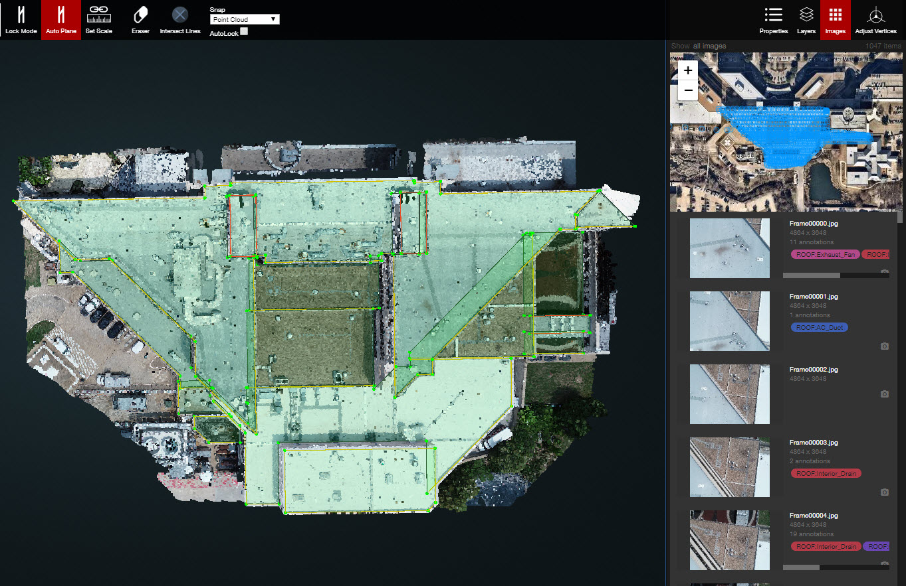
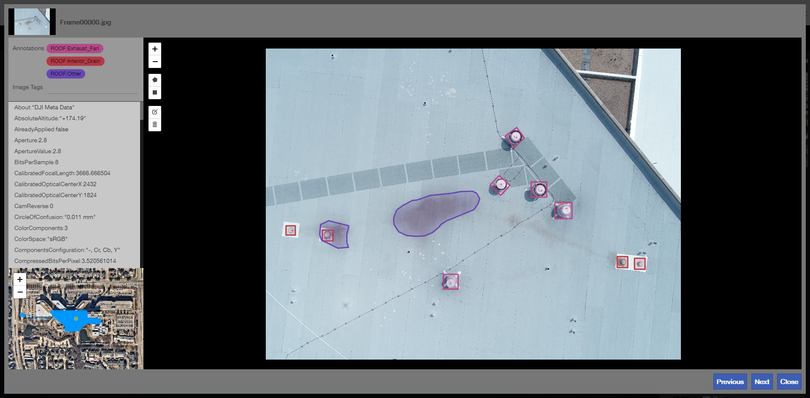
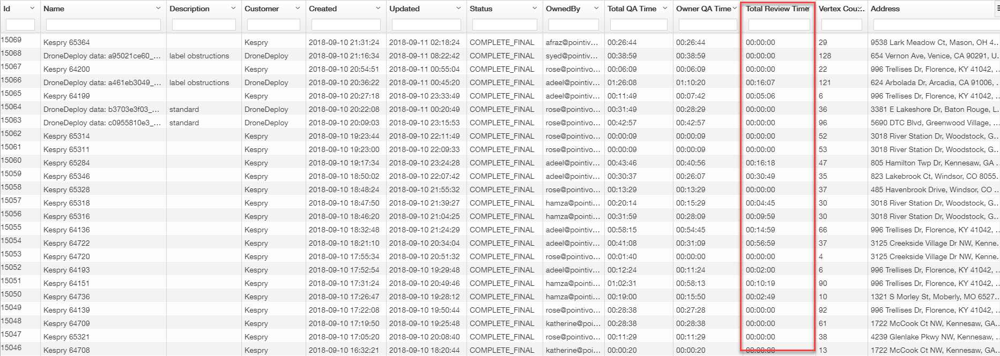

# September 12th 2018

## 📅Weekend Schedule - Beta

Since there are not any reviewers available over the weekend in the new production schedule, so we are going to implement a new schedule to cover the projects during the weekend.


US Team - Everyone is required to fill their availability before they take off on Friday. Please put "X" into the cell when you are **NOT available** over this weekend.


Open the link here 🚩 🚩 🚩 [https://docs.google.com/spreadsheets/d/17SjPC3CaxbrXNMWA-V3gs5UWG\_AlW-YGExpqLdkq2LA/edit?usp=sharing](https://docs.google.com/spreadsheets/d/17SjPC3CaxbrXNMWA-V3gs5UWG_AlW-YGExpqLdkq2LA/edit?usp=sharing)

When you are available, please check the queue to make sure there are not any `Past_Due` projects. If there are too many projects in the queue, slack everyone in the `Wireframe-SOS` channel to get our attention.

## 🔄Update - Output resource types


Except previous **GEOJSON, DXF and DATA\_PACKAGE,** all the new resources are only for internal use, they are not productive resources and please **DO NOT** publish these resources to our customer.


Brief introduction:

ORTHO:

ORTHO-REPORT:

DATAPACKAGE\_JSON:

## 🔄Update - Export function



## 🔄Update - Eraser



## 🔄Update - Validation



## 🔄Update - Project Issues



## 🆕New - Images panel

If you open the image panel, you will see all of the images including the ortho image with all of the camera locations. This is where we are going to do the 2D annotations and a more detailed training/workflow is coming.

## 🆕New - Inspect Tool

## 🆕New - 3D Canvas

## 🆕New - Total review time

Total review time is available via Intranet, but it is hidden by default. It shows how long the project stays in the IN\_REVIEW status, instead of how long the reviewer spends reviewing the project.

## 💯The DroneDeploy Complete Final Grading Phase of Afraz

Thanks for **Rose** 👩 and **Katherine** 👧, they have finished grading all remaining projects from **Afraz**.

| Project ID | Customer | Grader | Reviewer | Grade |
| :--- | :--- | :--- | :--- | :--- |
| 14741 | Tesla | Katherine | Rose | 99 |
| 14821 | Tesla | Katherine | Rose | 87 |
| 14585 | Tesla | Rose | Katherine | 92 |
| 14698 | DroneDeploy | Rose | Katherine | 81.7 |
|  |  |  | DroneDeploy Total Average | 89.9 |

📑 The detailed gradings could be found at [here.](https://docs.google.com/spreadsheets/d/18hYex09FSQzJUyOKFiIXiJkYAuo9PdqV6dYNS7FKaBQ/edit?usp=sharing)

🎆🎆🎇🎇 I am more than happy to announce that **Afraz** has passed the DroneDeploy grading period and is qualified for Complete\_Final all the projects without Review. 🎉🎉🎊🎊

